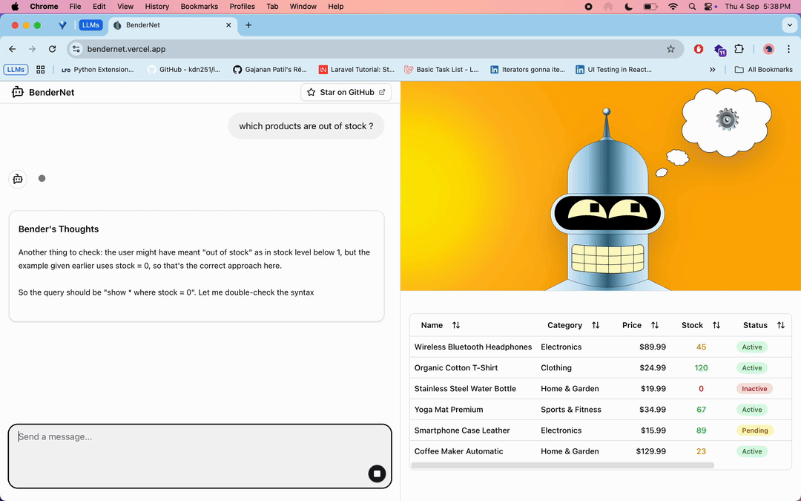

# BenderNet 🤖

[](https://github.com/gajananpp/bendernet/stargazers)
[](https://opensource.org/licenses/MIT)
[](https://www.typescriptlang.org/)
[](https://nextjs.org/)

**BenderNet** is an innovative chatbot that demonstrates how Small Language Models (SLMs) can produce structured output using grammar-based constraints. Built with WebLLM, LangGraph, and Lark Parser, it features the iconic Bender from Futurama as your sarcastic AI assistant.



## 🌟 Features

- **🧠 Browser-based AI**: Runs Qwen3-1.7B model entirely in your browser using WebLLM
- **📝 Grammar-constrained Output**: Uses Lark parser to ensure structured responses from the SLM
- **🎭 Bender Personality**: Sarcastic, witty responses in the style of Futurama's Bender
- **🔍 Natural Language Queries**: Ask questions about product data in plain English
- **⚡ Real-time Processing**: Fast query processing with visual feedback
- **🎨 Animated Avatar**: Custom SVG Bender avatar with GSAP animations
- **📊 Data Visualization**: Interactive table display for query results

## 🚀 Live Demo

Experience BenderNet in action: [Live Demo](https://bendernet.vercel.app)

## 🛠️ Technology Stack

### Core Technologies
- **Next.js 15**: React framework with static export capability
- **TypeScript**: Type-safe development
- **Tailwind CSS**: Utility-first CSS framework

### AI & Language Processing
- **@mlc-ai/web-llm**: Browser-based language model execution
- **@langchain/langgraph**: Agent workflow orchestration
- **Lark Parser**: Grammar-based output parsing
- **Qwen3-1.7B**: Small language model (960MB)

### UI & Animation
- **@assistant-ui/react**: Chat interface components
- **GSAP**: High-performance animations
- **Framer Motion**: React animation library
- **Radix UI**: Accessible component primitives

### Development Tools
- **Pyodide**: Python runtime in browser (for Lark parser)
- **Web Workers**: Background processing
- **Zustand**: State management

## 📋 Prerequisites

- Node.js 18+ 
- npm, yarn, pnpm, or bun
- Modern browser with WebAssembly support
- ~1GB free RAM (for model loading)

## 🔧 Installation

1. **Clone the repository**
   ```bash
   git clone https://github.com/gajananpp/bendernet.git
   cd bendernet
   ```

2. **Install dependencies**
   ```bash
   npm install
   # or
   yarn install
   # or
   pnpm install
   ```

3. **Set up environment variables** (Optional)
   ```bash
   cp .env.example .env.local
   ```
   Add your OpenAI API key if you want to use OpenAI models:
   ```
   OPENAI_API_KEY=sk-your-api-key-here
   ```

4. **Run the development server**
   ```bash
   npm run dev
   # or
   yarn dev
   # or
   pnpm dev
   ```

5. **Open your browser**
   Navigate to [http://localhost:3000](http://localhost:3000)

## 🎯 How It Works

### The Grammar-Constrained Approach

BenderNet demonstrates a novel approach to getting structured output from Small Language Models:

1. **Natural Input**: Users ask questions in plain English
   ```
   "Show me all electronics products under $50"
   ```

2. **Grammar-Guided Generation**: The SLM generates responses following a specific Lark grammar:
   ```lark
   start: query
   query: "show" columns ("where" condition)?
   columns: "*" | column_list
   column_list: IDENTIFIER ("," IDENTIFIER)*
   condition: IDENTIFIER OPERATOR value
   ```

3. **Structured Output**: The model produces grammar-compliant responses:
   ```
   show name, price where category = 'electronics' and price < 50
   ```

4. **Parsing & Execution**: Lark parser converts this to structured data and executes the query

### Architecture Overview

```
User Query → Classifier → Query Generator → Parser → Data Filter → Bender Response
     ↓            ↓             ↓           ↓          ↓            ↓
  Plain Text → Intent Check → Grammar → Structured → Results → Sarcastic Reply
```

## 💬 Usage Examples

### Basic Queries
```
"Show me all products"
"What electronics do we have?"
"Find products under $100"
"Show me out of stock items"
```

### Advanced Filtering
```
"Display name and price for electronics under $50"
"Show products with stock greater than 10"
"Find all available products in the books category"
```

### Bender's Personality
Bender responds with his characteristic sarcasm and attitude:
```
User: "Show me all products"
Bender: "Oh great, another meatbag wants to see the whole catalog. Here's your precious data..."
```

## 🗂️ Project Structure

```
bender-lark/
├── app/                    # Next.js app directory
│   ├── api/chat/          # Chat API endpoint
│   ├── assistant.tsx      # Main chat interface
│   ├── model-loader.tsx   # WebLLM model loading
│   └── web-llm-worker.ts  # WebLLM web worker
├── components/            # React components
│   ├── assistant-ui/      # Chat UI components
│   ├── bender-avatar.tsx  # Animated Bender SVG
│   ├── canvas.tsx         # Main canvas component
│   └── ui/               # Reusable UI components
├── lib/                   # Core utilities
│   ├── agent.ts          # LangGraph agent logic
│   ├── lark-parser-api.ts # Lark parser integration
│   ├── ChatWebLLM.ts     # WebLLM wrapper
│   └── store.ts          # Zustand store
├── assets/               # Static assets
└── public/              # Public files
```

## ⚙️ Configuration

### Model Configuration
The project uses Qwen3-1.7B by default. To change the model, update `lib/constants.ts`:

```typescript
export const MODEL_NAME = "Qwen3-1.7B-q4f16_1-MLC";
export const MODEL_SIZE = "960MB";
```

### Grammar Customization
Modify the Lark grammar in `assets/table-operations.lark.ts` to support different query types:

```lark
start: query
query: "show" columns ("where" condition)?
       | "count" columns ("where" condition)?
       | "sum" IDENTIFIER ("where" condition)?
```

## 🚀 Deployment

### Static Export
The project is configured for static export:

```bash
npm run build
```

This generates a static site in the `out/` directory that can be deployed to:
- Vercel
- Netlify
- GitHub Pages
- Any static hosting service

### Environment Variables
For production deployment, ensure you have:
- Proper CORS headers for WebAssembly
- Sufficient memory allocation for the model
- HTTPS enabled (required for some WebLLM features)

## 🎨 Customization

### Adding New Personalities
Create new personality prompts in `lib/agent.ts`:

```typescript
const personalityPrompts = {
  bender: "Sarcastic robot from Futurama...",
  friendly: "Helpful and cheerful assistant...",
  professional: "Formal business assistant..."
};
```

### Extending Grammar
Add new query types to the Lark grammar:

```lark
query: show_query | count_query | update_query
show_query: "show" columns ("where" condition)?
count_query: "count" ("where" condition)?
update_query: "update" IDENTIFIER "set" assignments ("where" condition)?
```

## 🔍 Performance

- **Model Size**: 960MB (Qwen3-1.7B quantized)
- **Load Time**: ~30-60 seconds (first time)
- **Memory Usage**: ~1GB RAM
- **Inference Speed**: ~2-5 tokens/second (varies by device)

## 🤝 Contributing

1. Fork the repository
2. Create your feature branch (`git checkout -b feature/AmazingFeature`)
3. Commit your changes (`git commit -m 'Add some AmazingFeature'`)
4. Push to the branch (`git push origin feature/AmazingFeature`)
5. Open a Pull Request

## 📚 Learn More

### Inspiration & Resources
- [Sarah Drasner's SVG Animations](https://codepen.io/sdras) - SVG animation techniques
- [WebLLM Documentation](https://webllm.mlc.ai/) - Browser-based LLM execution
- [Lark Parser](https://lark-parser.readthedocs.io/) - Grammar-based parsing
- [LangGraph](https://langchain-ai.github.io/langgraph/) - Agent workflows

### Related Concepts
- **Grammar-Constrained Generation**: Ensuring LLM outputs follow specific formats
- **Small Language Models**: Efficient models for specialized tasks
- **Domain Specific Languages (DSL)**: Custom languages for specific domains
- **In-browser AI**: Running ML models without server dependencies

## 🐛 Troubleshooting

### Model Loading Issues
- Ensure you have enough RAM (1GB+)
- Check browser console for WebAssembly errors
- Try refreshing the page if loading stalls

### Performance Issues
- Close other browser tabs to free memory
- Use Chrome/Edge for better WebAssembly performance
- Consider using a more powerful device for better inference speed

### Parser Errors
- Check that your queries follow the expected grammar
- Ensure the Lark parser worker is loading correctly
- Verify the grammar definition in the assets folder

## 📄 License

This project is licensed under the MIT License - see the [LICENSE](LICENSE) file for details.

## 👨‍💻 Author

**Gajanan Patil**
- Email: patil.gajananps@gmail.com
- LinkedIn: [gajananpp](https://www.linkedin.com/in/gajananpp)
- GitHub: [gajananpp](https://github.com/gajananpp)

## 🙏 Acknowledgments

- **Futurama** creators for the iconic Bender character
- **MLC-AI** team for WebLLM
- **LangChain** team for LangGraph
- **Lark** parser developers
- **Assistant-UI** contributors
- The open-source community

---

*"Bite my shiny metal README!"* - Bender 🤖
